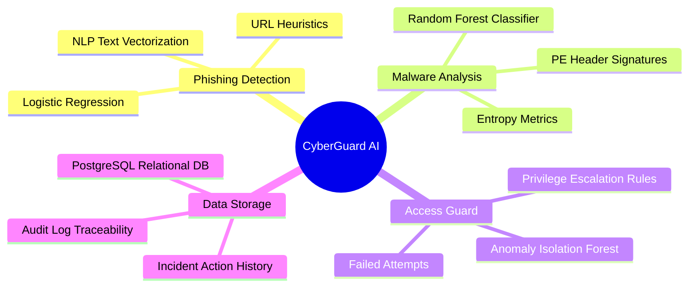
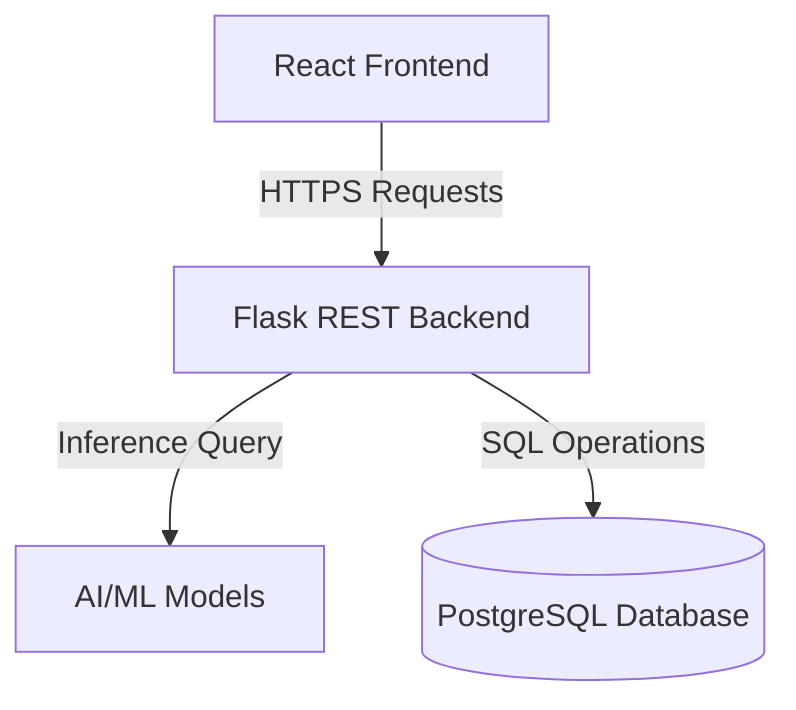
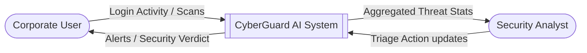
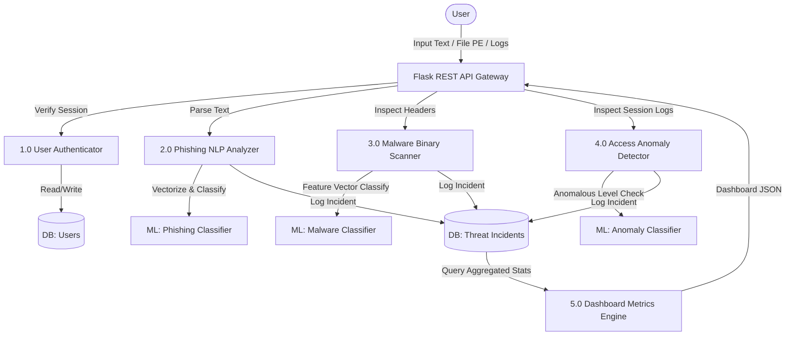

# Project Documentation: Adversarial Attacks and Defenses (CyberGuard AI)

This document contains the strategic, analytical, and architectural details for **CyberGuard AI**, an end-to-end AI-driven threat detection and defense orchestration platform built for ABC Corporation.

---

## 1. Empathy Map
Designed to align defensive system design with the user experience of security operators and corporate employees.

| Quadrant | Security Analyst (Incident Response) | Corporate Employee |
| :--- | :--- | :--- |
| **SAYS** | "Analyzing thousands of logs manually is exhausting." "We need a fast, automated way to triage file downloads and phishing reports." | "Is this email safe to click?" "My computer feels slow, could it be malware?" |
| **THINKS** | "I hope a major breach isn't happening right now." "If we can filter out the noise, we can focus on advanced threats." | "I don't want to get blamed for a security breach." "Security procedures sometimes slow down my daily work." |
| **DOES** | Reviews logs, runs manual file analysis, maintains blocklists, triggers patch updates. | Checks email, downloads attachments, accesses internal databases, logs into corporate portals. |
| **FEELS** | Stressed by alert fatigue, anxious about missing critical incidents, proactive. | Uncertain, cautious, sometimes annoyed by complex security checks, protective of company assets. |
| **PAINS** | • High false-positive rates in existing tools. • Lack of unified threat views. • Delayed incident response times. | • Confusion identifying sophisticated phishing. • Security alerts that interrupt workflows. • Fear of making mistakes. |
| **GAINS** | • Centralized visual dashboard. • High-accuracy ML-driven threat detection. • Faster containment and remediation suggestions. | • Instant checking of suspicious content. • Confidence that endpoint protection is active. • Clean, non-intrusive security notifications. |

---

## 2. Brainstorming Map

---

## 3. Proposed Solution
**CyberGuard AI** is a consolidated web suite addressing threat vectors by combining Machine Learning classifiers with a live operations dashboard.
* **Phishing Shield**: Implements a Term Frequency-Inverse Document Frequency (TF-IDF) feature engineering pipeline coupled with a Logistic Regression classifier to inspect email semantics.
* **Malware Static Sandbox**: Employs a Random Forest Classifier trained on structural features of PE headers (entropy, size, signature status, section properties) to flag malicious files.
* **Access Guard**: Runs anomaly classification logic on session metadata (login hours, geographic location leaps, privilege levels requested) to block unauthorized access.

---

## 4. Solution Architecture

---

## 5. Data Flow Diagrams

### DFD Level 0 (Context Diagram)

### DFD Level 1 (Detailed Process Diagram)

---

## 6. Technology Stack
* **Frontend**: React (Vite environment), styled with high-end modular Vanilla CSS (glassmorphism tokens, responsive grid layouts).
* **Backend**: Python Flask REST API server.
* **Database**: PostgreSQL (backed by SQLAlchemy ORM with SQLite local fallback).
* **Machine Learning**: `scikit-learn` for TF-IDF Text Vectorization, Logistic Regression, and Random Forest classification.

---

## 7. Sprint Planning
* **Sprint 1**: Database schema creation, synthetic cybersecurity dataset compilation, ML model training, and pickle model serialization.
* **Sprint 2**: Flask server configuration, endpoint routing (`/api/auth`, `/api/detect`, `/api/dashboard`), and database logger implementation.
* **Sprint 3**: React UI layout design, styling index setup, state binding to Flask endpoints, and dashboard widgets construction.
* **Sprint 4**: Integration testing, system documentation, and repository deployment to GitHub.
